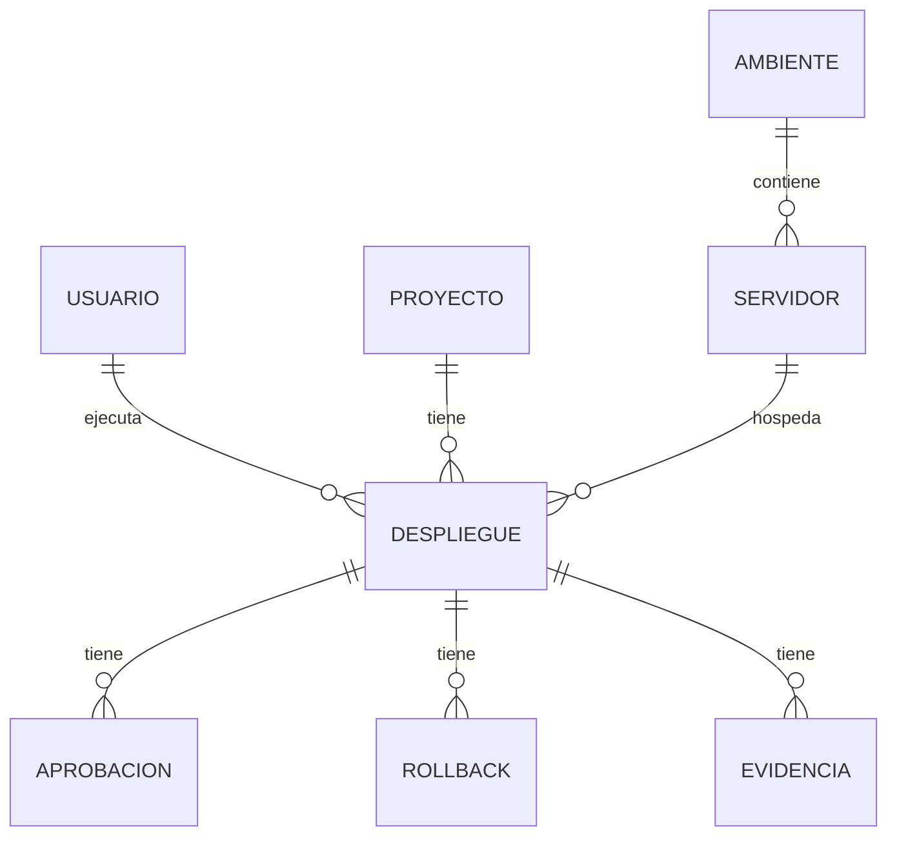

# Base de datos — Control de despliegue de software

Documentación de la estructura relacional usada por el **Dashboard DevOps**. Está pensada para **PostgreSQL local** (no requiere servidor en la nube).

---

## Resumen

| Concepto | Detalle |
|----------|---------|
| Motor | PostgreSQL 14+ |
| Base por defecto | `postgres` |
| Tablas del dashboard | **8** |
| Hecho central | `despliegue` |
| Datos de prueba | 15 despliegues (trimestre **T2 2026**: abril–junio) |
| Script de instalación | `scripts/database-model.sql` |
| Comando rápido | `pnpm db:setup` |

---

## Cómo crear la base en tu PC

```bash
# 1. Copiar variables de conexión
copy .env.example .env.local

# 2. Crear tablas + cargar datos de ejemplo
pnpm db:setup
```

Alternativa con `psql`:

```bash
psql -U postgres -d postgres -f scripts/database-model.sql
```

> **Windows:** en `.env.local` usa `PG_HOST=127.0.0.1` (no `localhost`) si aparece error SASL al conectar.

---

## Vista general del modelo

El proceso de negocio modelado es: **desplegar software a partir de un commit validado**, con trazabilidad (evidencias), gobernanza (aprobaciones) y control de fallos (rollbacks).

```
                    ┌─────────────┐
                    │  AMBIENTE   │
                    └──────┬──────┘
                           │ 1:N
                    ┌──────▼──────┐
                    │  SERVIDOR   │
                    └──────┬──────┘
                           │
     ┌─────────────┐       │       ┌─────────────┐
     │   USUARIO   │       │       │  PROYECTO   │
     └──────┬──────┘       │       └──────┬──────┘
            │              │              │
            └──────┬───────┴───────┬──────┘
                   │               │
            ┌──────▼───────────────▼──────┐
            │        DESPLIEGUE         │  ← HECHO CENTRAL
            └──────┬───────────┬────────┘
                   │           │
        ┌──────────┼───────────┼──────────┐
        │          │           │          │
   ┌────▼────┐ ┌───▼────┐ ┌────▼────┐
   │APROBACION│ │ROLLBACK│ │EVIDENCIA│
   └─────────┘ └────────┘ └─────────┘
```

### Orden de dependencias (para borrar o crear)

1. `usuario`, `proyecto`, `ambiente` (sin FK entre sí)
2. `servidor` → depende de `ambiente`
3. `despliegue` → depende de `usuario`, `proyecto`, `servidor`
4. `aprobacion`, `rollback`, `evidencia` → dependen de `despliegue`

---

## Diagrama entidad-relación



---

## Tablas y columnas

### 1. `usuario` (dimensión)

Personas que solicitan o ejecutan despliegues.

| Columna | Tipo | Restricción | Descripción |
|---------|------|-------------|-------------|
| `id_usuario` | INTEGER | **PK** | Identificador |
| `nombre_completo` | VARCHAR(120) | NOT NULL | Nombre |
| `correo` | VARCHAR(120) | NOT NULL, UNIQUE | Email |
| `area` | VARCHAR(80) | | Área (TI, QA, etc.) |
| `cargo` | VARCHAR(80) | | Puesto |
| `rol_asignado` | VARCHAR(60) | | Rol (Administrador, Aprobador…) |
| `activo` | BOOLEAN | DEFAULT true | Usuario habilitado |

**Datos de prueba:** 5 usuarios.

---

### 2. `proyecto` (dimensión)

Aplicaciones o repositorios desplegables.

| Columna | Tipo | Restricción | Descripción |
|---------|------|-------------|-------------|
| `id_proyecto` | VARCHAR(20) | **PK** | Código (ej. `PRJ-PAY`) |
| `nombre` | VARCHAR(120) | NOT NULL | Nombre visible |
| `descripcion` | TEXT | | Descripción |
| `repositorio` | VARCHAR(255) | | URL o ruta Git |
| `rama_principal` | VARCHAR(80) | | Rama por defecto |
| `estado` | VARCHAR(40) | | Activo, Mantenimiento… |
| `version_actual` | VARCHAR(40) | | Versión en producción |

**Datos de prueba:** 4 proyectos (API de Pagos, Frontend Web, Portal Proveedores, App Móvil).

---

### 3. `ambiente` (dimensión)

Contextos de infraestructura (Producción, Staging, QA, Desarrollo).

| Columna | Tipo | Restricción | Descripción |
|---------|------|-------------|-------------|
| `id_ambiente` | VARCHAR(20) | **PK** | Código (ej. `ENV-PROD`) |
| `nombre` | VARCHAR(80) | NOT NULL, UNIQUE | Nombre (Producción, QA…) |
| `descripcion` | TEXT | | Detalle |
| `criticidad` | VARCHAR(20) | | Alta, Media, Baja |
| `requiere_aprobacion` | BOOLEAN | DEFAULT false | Si exige aprobación previa |

**Datos de prueba:** 4 ambientes. Producción y Staging **requieren aprobación**.

---

### 4. `servidor` (dimensión)

Hosts donde se instala el software, ligados a un ambiente.

| Columna | Tipo | Restricción | Descripción |
|---------|------|-------------|-------------|
| `id_servidor` | VARCHAR(20) | **PK** | Código (ej. `SRV-PROD-01`) |
| `id_ambiente` | VARCHAR(20) | **FK → ambiente** | Ambiente destino |
| `nombre_host` | VARCHAR(150) | NOT NULL | Hostname |
| `ruta_espacio` | VARCHAR(255) | | Ruta de despliegue |
| `tipo_servidor` | VARCHAR(80) | | Linux VPS, Docker Host… |
| `administrado_por` | VARCHAR(120) | | Responsable |
| `estado_servidor` | VARCHAR(40) | | Online, Offline… |

**Datos de prueba:** 4 servidores (uno por ambiente principal).

---

### 5. `despliegue` (hecho central)

Evento de despliegue: commit → ejecución → resultado.

| Columna | Tipo | Restricción | Descripción |
|---------|------|-------------|-------------|
| `id_despliegue` | VARCHAR(20) | **PK** | Código (ej. `DEP-001`) |
| `id_usuario` | INTEGER | **FK → usuario** | Quién lo ejecuta |
| `id_proyecto` | VARCHAR(20) | **FK → proyecto** | Qué se despliega |
| `id_servidor` | VARCHAR(20) | **FK → servidor** | Dónde se despliega |
| `commit_hash` | VARCHAR(64) | | Hash del commit (**validación**) |
| `fecha_solicitud` | TIMESTAMP | NOT NULL | Cuándo se pidió |
| `fecha_inicio` | TIMESTAMP | | Inicio de instalación |
| `fecha_fin` | TIMESTAMP | | Fin (**migración concluida**) |
| `estado` | VARCHAR(40) | NOT NULL | Exitoso, Fallido, En Progreso… |
| `resultado_final` | VARCHAR(80) | | Detalle del resultado |
| `observacion` | TEXT | | Notas |

**Índices:** `estado`, `(fecha_solicitud, fecha_fin)`.

**Regla:** `fecha_fin >= fecha_inicio` cuando ambas existen.

**Estados en datos de prueba:**

| Estado | Cantidad (aprox.) |
|--------|-------------------|
| Exitoso | 8 |
| Fallido | 4 |
| En Progreso | 2 |
| Cancelado | 1 |

**Datos de prueba:** 15 filas (fechas entre **2026-05-20** y **2026-06-02**).

---

### 6. `aprobacion` (control — gobernanza)

Registro de aprobación antes de desplegar en ambientes críticos.

| Columna | Tipo | Restricción | Descripción |
|---------|------|-------------|-------------|
| `id_despliegue` | VARCHAR(20) | **PK, FK → despliegue** | Despliegue |
| `nro_aprobacion` | INTEGER | **PK** | Número secuencial |
| `aprobador` | VARCHAR(120) | NOT NULL | Quién aprueba |
| `decision` | VARCHAR(40) | NOT NULL | Aprobado, Rechazado… |
| `fecha_decision` | TIMESTAMP | NOT NULL | Cuándo decidió |
| `comentario` | TEXT | | Comentario |

**Datos de prueba:** 4 aprobaciones (decisión `Aprobado`).

---

### 7. `rollback` (control — riesgo)

Reversión tras un despliegue fallido o de riesgo.

| Columna | Tipo | Restricción | Descripción |
|---------|------|-------------|-------------|
| `id_despliegue` | VARCHAR(20) | **PK, FK → despliegue** | Despliegue afectado |
| `nro_rollback` | INTEGER | **PK** | Número secuencial |
| `commit_anterior` | VARCHAR(64) | | Versión restaurada |
| `motivo` | TEXT | NOT NULL | Razón del rollback |
| `fecha_rollback` | TIMESTAMP | NOT NULL | Cuándo se revirtió |
| `resultado` | VARCHAR(40) | | Exitoso, Fallido… |
| `responsable` | VARCHAR(120) | | Quién ejecutó el rollback |

**Datos de prueba:** 4 rollbacks (en despliegues fallidos de API de Pagos y Frontend Web).

---

### 8. `evidencia` (control — trazabilidad)

Archivos o registros que respaldan el despliegue.

| Columna | Tipo | Restricción | Descripción |
|---------|------|-------------|-------------|
| `id_despliegue` | VARCHAR(20) | **PK, FK → despliegue** | Despliegue |
| `nro_evidencia` | INTEGER | **PK** | Número secuencial |
| `tipo_evidencia` | VARCHAR(60) | NOT NULL | Log, Reporte QA, Captura… |
| `ruta_archivo` | VARCHAR(255) | | Ruta del archivo |
| `hash_archivo` | VARCHAR(64) | | Hash de integridad |
| `fecha_registro` | TIMESTAMP | NOT NULL | Fecha de carga |
| `descripcion` | TEXT | | Descripción |

**Datos de prueba:** 11 evidencias (73 % de cobertura sobre 15 despliegues).

---

## Relaciones (claves foráneas)

| Tabla origen | Columna | Tabla destino | Columna | ON DELETE |
|--------------|---------|---------------|---------|-----------|
| `servidor` | `id_ambiente` | `ambiente` | `id_ambiente` | RESTRICT |
| `despliegue` | `id_usuario` | `usuario` | `id_usuario` | RESTRICT |
| `despliegue` | `id_proyecto` | `proyecto` | `id_proyecto` | RESTRICT |
| `despliegue` | `id_servidor` | `servidor` | `id_servidor` | RESTRICT |
| `aprobacion` | `id_despliegue` | `despliegue` | `id_despliegue` | CASCADE |
| `rollback` | `id_despliegue` | `despliegue` | `id_despliegue` | CASCADE |
| `evidencia` | `id_despliegue` | `despliegue` | `id_despliegue` | CASCADE |

---

## Mapeo al diseño lógico del proyecto

| Entidad del diseño | Implementación en esta BD |
|--------------------|---------------------------|
| **USUARIO** | Tabla `usuario` |
| **PROYECTO** | Tabla `proyecto` |
| **AMBIENTE** | Tabla `ambiente` |
| **SERVIDOR** | Tabla `servidor` |
| **DESPLIEGUE** | Tabla `despliegue` |
| **VALIDACION** (commit validado) | Columna `despliegue.commit_hash` |
| **APROBACION** | Tabla `aprobacion` |
| **MIGRACION** | Columnas `fecha_fin` + `estado` / `resultado_final` |
| **EVIDENCIA** | Tabla `evidencia` |
| **ROLLBACK** | Tabla `rollback` |

No existen tablas separadas `validacion` ni `migracion` en PostgreSQL; el dashboard interpreta esos conceptos como se indica arriba.

---

## Cómo consulta el dashboard

El API (`src/app/api/dashboard/route.ts`) une las tablas así:

```sql
FROM despliegue d
JOIN proyecto p   ON d.id_proyecto = p.id_proyecto
JOIN servidor s   ON d.id_servidor = s.id_servidor
JOIN ambiente a   ON s.id_ambiente = a.id_ambiente
LEFT JOIN usuario u ON d.id_usuario = u.id_usuario
LEFT JOIN evidencia e  ON e.id_despliegue = d.id_despliegue
LEFT JOIN aprobacion ap ON ap.id_despliegue = d.id_despliegue
LEFT JOIN rollback r    ON r.id_despliegue = d.id_despliegue
```

Los filtros por **trimestre** usan:

```sql
COALESCE(d.fecha_fin, d.fecha_inicio, d.fecha_solicitud)
```

---

## Volúmenes de datos de prueba

| Tabla | Filas |
|-------|------:|
| usuario | 5 |
| proyecto | 4 |
| ambiente | 4 |
| servidor | 4 |
| despliegue | 15 |
| aprobacion | 4 |
| rollback | 4 |
| evidencia | 11 |

---

## Archivos relacionados

| Archivo | Propósito |
|---------|-----------|
| `scripts/database-model.sql` | DDL + INSERT (fuente de verdad) |
| `scripts/setup-database.mjs` | Ejecuta el SQL desde Node |
| `scripts/seed-trimestre.sql` | Consulta de verificación del trimestre Q2 |
| `seed_db.js` | Script alternativo (mismo dataset, vía Node/pg) |
| `.env.example` | Plantilla de conexión |
| `docs/MODELO-DATOS.md` | Diagrama ER detallado (Mermaid) |

---

## Verificación después de instalar

```sql
SELECT 'despliegue' AS tabla, COUNT(*) FROM despliegue
UNION ALL SELECT 'evidencia', COUNT(*) FROM evidencia;
```

Deberías ver **15** despliegues y **11** evidencias. En el dashboard, el trimestre por defecto **T2 2026** debe mostrar esos 15 registros.
